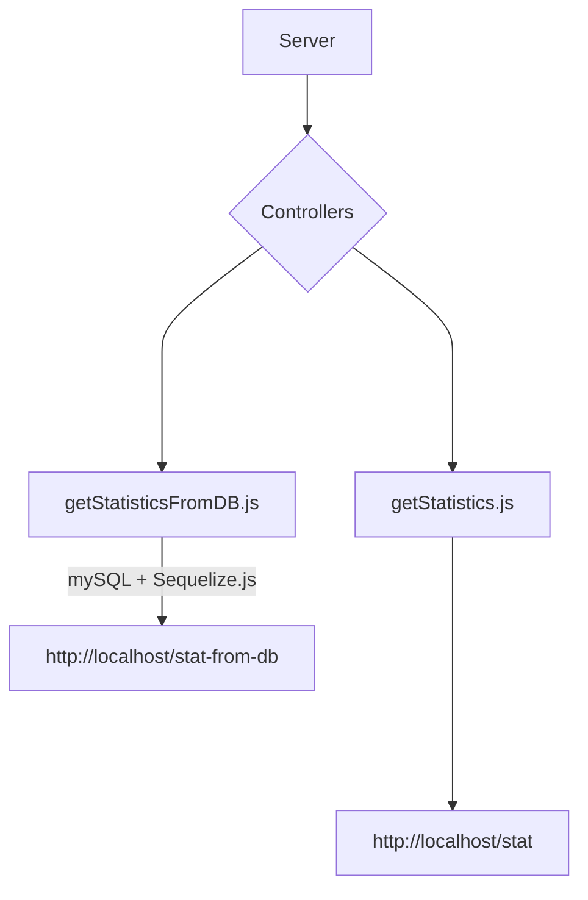

# Payroll Backend Implementations


## Prerequisite

Make sure the port is clear
```
fuser -k 3000/tcp
```
Set up a mySQL database

```
sudo apt install mysql-server
```
Create a user or root with grant access to databases

Login and then, create database called "Payroll"

```
CREATE DATABASE payroll
USE payroll
```

Once the repository is cloned, enter the repository and install packages

```
npm install
```

and start server


```
npm run start
```




## Running instructions

Make sure the dependencies are installed.

```
npm install
```

Generate the data for the app.

```
npm run data:generate
```

To start the web application, use the following command.

```
npm run start
```


