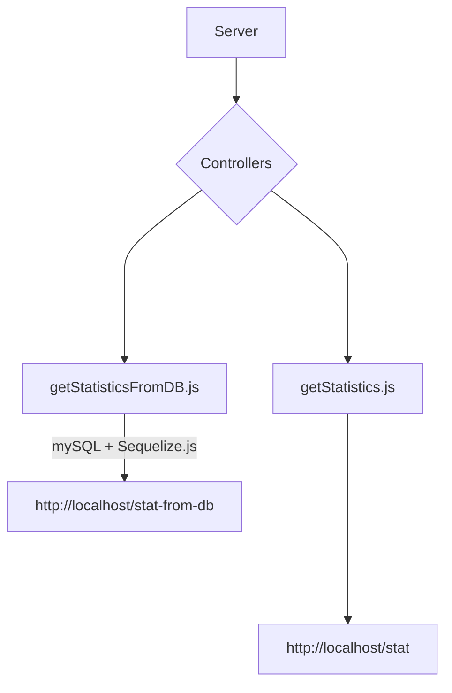

# Klink Backend Developer Coding Challenge


## Prerequisite

Make sure the port is clear
```
fuser -k 3000/tcp
```
Set up a mySQL database

```
sudo apt install mysql-server
```
Create a user or root with grant access to databases

Login and then, create database called "Payroll"

```
CREATE DATABASE payroll
USE payroll
```

Once the repository is cloned, enter the repository and install packages

```
npm install
```

and start server


```
npm run start
```




### Assignment 


Welcome to the Klink backend coding challenge.

The assignment consists of a simple web application and helper scripts to automate the most common tasks. Feel free to modify the project for your convenience while keeping focused on the assignment goals.

## Running instructions

Make sure the dependencies are installed.

```
npm install
```

Generate the data for the app.

```
npm run data:generate
```

To start the web application, use the following command.

```
npm run start
```

## Assignment goals

Once the data is generated, follow the comments in the file `src/app.js`.

The generated data is placed in `data/payroll.json`.

1. Create the controller that aggregates data from the JSON file and returns them in the following format.

```json
{
    "number_of_employees": "",        // number of employees in the data set
    "sum_of_paid_salaries": "",       // sum of the salaries listed across the data set
    "average_salary": "",             // average salary of all employees
    "average_salary_by_position": {   // average salary aggregated by position
        "Associate": "",
        "Specialist": "",
        "Executive": "",
        // and so on, for all position types
    }
}
```

1. Create a database to calculate the data above using the database engine. You can use any database and library you find yourself comfortable with, i.e. SQLite with Knex. The response format is identical to the first point.

Please make sure that the commit history is available in your submitted repository.

## Submitting results

Please create a local git repository and push your changes there. Once finished, share the repo online and please send us the link.

You can share the code on your GitHub private repository.

## Final words

Good luck! 

If you have any questions about the assignment, please email us at [michal@klinkfinance.com](mailto:michal@klinkfinance.com).
